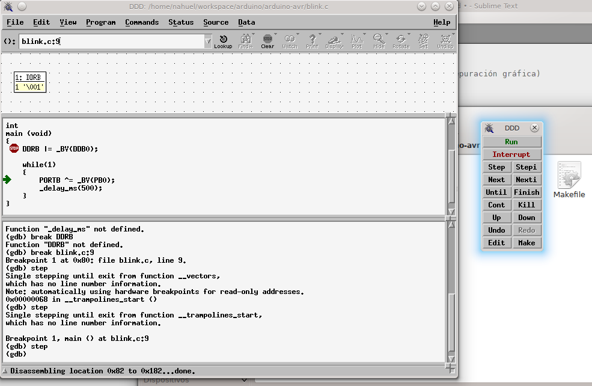

# Como compilar código AVR sin IDE

1. Es necesario contar con avr-gcc, simavr y ddd (para depuración gráfica)
2. Ejecutar `make`
   La salida debería ser simlar a la siguiente:

        $ make
        avr-gcc -mmcu=atmega328p -Wall -Os -g3 -o blink.elf blink.c
        avr-objcopy -j .text -j .data -O ihex blink.elf blink.hex

3. Ejecutar `make simulate` en una terminal. La salida debería ser como
   la siguiente:

        $ make simulate
        simavr -g -f 8000000 -m atmega328p blink.hex
        Loaded 1 section of ihex
        Load HEX flash 00000000, 162
        avr_interrupt_reset
        avr_gdb_init listening on port 1234

4. En otra terminal, ejecutar `make rungdb`

    

